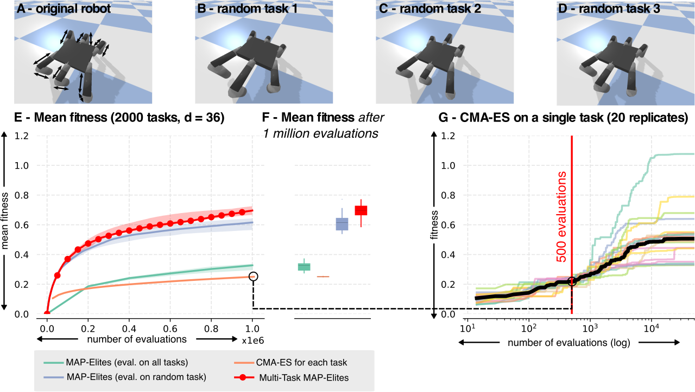

Quality Diversity (QD) algorithms are a recent family of optimization algorithms that search for a large set of diverse but high-performing solutions. In some specific situations, they can solve multiple tasks at once. For instance, they can find the joint positions required for a robotic arm to reach a set of points, which can also be solved by running a classic optimizer for each target point. However, they cannot solve multiple tasks when the fitness needs to be evaluated independently for each task (e.g., optimizing policies to grasp many different objects). In this paper, we propose an extension of the MAP-Elites algorithm, called Multi-task MAP-Elites, that solves multiple tasks when the fitness function depends on the task. We evaluate it on a simulated parameterized planar arm (10-dimensional search space; 5000 tasks) and on a simulated 6-legged robot with legs of different lengths (36-dimensional search space; 2000 tasks). The results show that in both cases our algorithm outperforms the optimization of each task separately with the CMA-ES algorithm.

 
<figcaption style="text-align: left;">
<b>(A) The robot is parameterized by 12 values that correspond to the length of the 12 segments indicated b
y arrows. (B-D) Examples of randomly generated morphologies. (E) Mean fitness for all tasks with respect to the number of evaluations (20 replicates). The solid line 
represents the median over 20 replicates and the light zones the interquartile range. (F) Mean fitness value after 1 million evaluations. All the differences are statistically 
significant (Mann-Whitney U-test, p < 0.0005). (G) Fitness of gaits generated by CMA-ES if given many more evaluations (here, 100,000) and a single task. Each line is an
 individual run and the thick black line is the median.
</figcaption>

